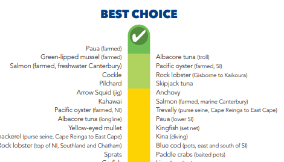

# Fish List

Oh no! The client previously hired an unscrupulous development team who under-bid for the contract and eventually reneged on it, leaving the product not even close to finished. Now it's on you. Somehow, you've got to take the code they left behind and turn it into a working product.

## The product

The client wants an app that can display a list of fish species in the waters around New Zealand and indicate which ones are best for consumers to choose in order to preserve fragile ecosystems and discourage overfishing. They'd like something similar to Forest & Bird's [Best Fish Guide](https://www.forestandbird.org.nz/sites/default/files/2018-05/Best%20Fish%20Guide%20-%20Pocket%20Guide.pdf), but in a web application with some more bells and whistles.

They'd definitely like it to be colourful, but how it's visualised is up to you and your team to decide. However you display the fish, they should be able to be viewed by:

* best choice
* worst choice
* alphabetical (and reverse)

There should also be a live search feature that updates the visible fish as you type.

Later, once you've got the basics down, they'd really like certain users to be able to add and edit fish, view the fish individually for more information on species and environmental threat, upload pictures, and more. Their feature ideas are as deep as te moana!

(Oh, and they don't have the budget for a full native mobile build-out just yet, but if you managed to make it into a PWA they certainly wouldn't say no!)

## What you've got

The original developers left you a rough client/server architecture. The server seems to have some authentication code on it. The client looks as if they were starting to sketch out a layout using [Semantic UI React](https://react.semantic-ui.com). And hey, look, there's a few tests in there!

There's a couple of database tables: one primitive table labelled "fish", and a users table with a test user in it. To be frank, it looks like someone wrote a demo and tried to turn it into a functioning application...

## What you'll need

It seems like you're going to need to be able to categorise the fish in some way. Perhaps a `categories` table might be in order? Or you could choose to add a `threat_level` field to the table. Then you should probably distinguish line-caught, trawled, long-line, bottom trawling, and so on, so you might need a `methods` table of some sort, and seeds to match.

Then if you're going to display extra data about each fish, you'll need a place to put that, and maybe a URL for a picture. Hrm. And there's all _kinds_ of scope creep available here if the threat level changes for a species, or you need different values for the same species but different methods of fishing...

You're definitely going to need more routes. And more coffee.

## Your team

Luckily, you have some senior developers supervising the work ahead. Because everyone wants a good result for the clients, there will be some constraints around how product development proceeds:

* no code committed to master (all PRs to be submitted to the `development` branch)
* all work takes place on a new feature branch
* no work gets done without an accompanying GitHub Projects ticket
* all PRs will be reviewed before merging
* all PRs will be accompanied by at least one test

You can organise yourselves however you like. Think about what learning goals you still have at this stage. What would you like to learn over the next few days?

## Good luck!

And may the fish be with you.

